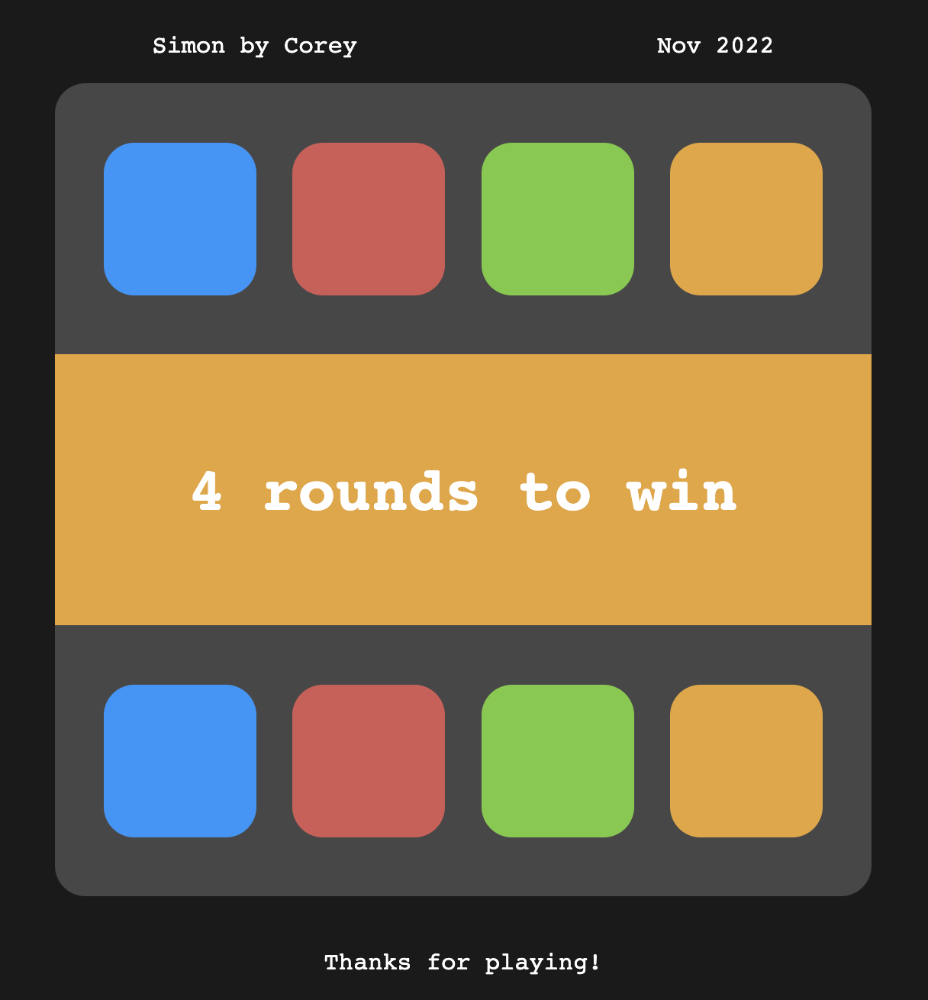

# Simon by Corey

- created November 2022
- for General Assembly | Software Engineering Intensive 10-31
- written in HTML, CSS, JavaScript
- based on [Simon](<https://en.wikipedia.org/wiki/Simon_(game)>), created by Milton Bradley in 1978.

## Screenshots:

## Getting started:

- Play the game at (https://coreyloftus.github.io/simon-by-corey/).

## Next steps:

- Tweak timing of message displays at round changes.
- Add option for Player to specify number of rounds (or play til infinity!)
- Add media queries to adjust for mobile screen sizes.

## Contact:

Thanks for checking out my game!

Questions? Feedback? Contact me at coreyloftus@gmail.com.
